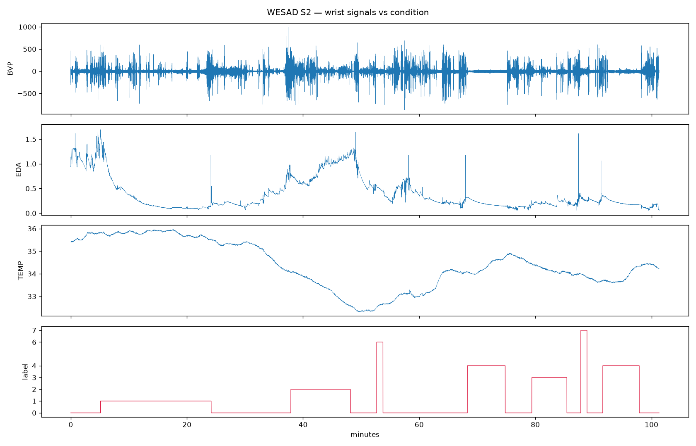

# Wearable Stress Detection from Wrist Sensors

Stress classification from consumer-grade wrist wearable signals, evaluated with
leave-one-subject-out validation on the WESAD dataset.

**Headline result: 0.93 macro F1 for binary stress detection using wrist signals only.**



*Wrist BVP, EDA and skin temperature for one subject against the condition track. EDA climbs through the stress block while peripheral temperature falls.*

Save the file, then tell me when it's done.
---

## Why wrist-only

WESAD provides two sensor sets: a chest strap (RespiBAN, 700 Hz ECG/EDA/EMG/respiration)
and a wrist wearable (Empatica E4, 4–64 Hz PPG/EDA/temperature/accelerometer).

Most published results use the chest data because it is cleaner. Nobody wears a chest
strap at home. This project deliberately restricts itself to the wrist device, because
that is the form factor remote patient monitoring actually ships in — the constraint is
the point, not a limitation.

## Data

| | |
|---|---|
| Subjects | 15 (S2–S17, excluding S1 and S12, which are not released) |
| Conditions | baseline, stress (TSST), amusement, meditation |
| Wrist sensors | BVP 64 Hz, EDA 4 Hz, temperature 4 Hz, accelerometer 32 Hz |
| Windows extracted | 1,032 (60 s, 50% overlap) |
| Class balance | baseline 562 · stress 307 · amusement 163 |

Windows are retained only when at least 90% of their samples carry a single condition
label; windows straddling a transition are discarded.

## Signal processing

Each sensor is sliced by its own sampling rate over a shared wall-clock window rather
than resampled to a common rate, preserving the full resolution of the PPG trace.

**Heart rate and HRV** are derived from the BVP signal: 3rd-order Butterworth bandpass
at 0.7–3.7 Hz (42–222 bpm) to remove baseline wander, peak detection with a 0.4 s
refractory constraint, then inter-beat intervals filtered to a physiologically plausible
0.35–2.0 s range. SDNN and RMSSD are computed from the surviving intervals.

**Electrodermal activity** contributes tonic level statistics plus a phasic peak count
approximating skin conductance responses.

**Accelerometer magnitude** serves double duty as an activity feature and a motion
artifact indicator — the dominant failure mode for wrist PPG.

17 features per window in total.

## Validation

Leave-one-subject-out. Train on 14 participants, test on the 15th, rotate.

This matters more than the model choice. Splitting by window rather than by subject
leaks a participant's personal baseline into training, and the resulting scores are
meaningless — the model memorizes individual resting heart rate rather than learning
stress. Grouped splits are used throughout.

Macro F1 is reported rather than accuracy, because the classes are imbalanced and
accuracy rewards majority-class collapse (see the three-class results below).

## Results

### Binary — stress vs non-stress

| Model | Features | Macro F1 |
|---|---|---|
| **Random forest** | **subject-normalized** | **0.931** |
| Logistic regression | subject-normalized | 0.927 |
| Random forest | raw | 0.906 |
| Logistic regression | raw | 0.846 |

Per-subject scores range from 1.000 (S10) to 0.495 (S17).

### Three-class — baseline vs stress vs amusement

| Model | Features | Macro F1 | Accuracy |
|---|---|---|---|
| **Logistic regression** | **subject-normalized** | **0.713** | 0.744 |
| Random forest | subject-normalized | 0.683 | 0.794 |
| Random forest | raw | 0.672 | 0.793 |
| Logistic regression | raw | 0.658 | 0.684 |

Stress itself is detected well even in the three-class setting — 0.894 precision,
0.906 recall, 0.900 F1 for the best model.

### Feature importance (binary task)

| Feature | Importance |
|---|---|
| eda_max | 0.220 |
| eda_mean | 0.174 |
| eda_min | 0.111 |
| eda_std | 0.111 |
| hr_mean | 0.087 |
| hr_std | 0.067 |
| sdnn | 0.031 |
| rmssd | 0.030 |

Electrodermal features account for roughly 62% of total importance. Heart rate
contributes meaningfully; HRV features contribute little, most likely because wrist PPG
beat detection is too noisy over 60-second windows to yield stable interval statistics.

## Findings

**Per-subject normalization is worth more than model selection.** Z-scoring features
within each participant lifted three-class macro F1 from 0.658 to 0.713 and raised
stress F1 to 0.900. Absolute electrodermal level varies enormously between people —
one person's calm reads as another's arousal. This is precisely why commercial wearables
run a calibration period when first worn.

**Accuracy actively misleads on this task.** The random forest posts higher three-class
accuracy than logistic regression (0.794 vs 0.744) while scoring *lower* macro F1
(0.683 vs 0.713). It wins by predicting the majority class and largely abandoning
amusement, reaching only 23% recall on it. Any evaluation reporting accuracy alone would
have selected the worse model.

**Amusement is not separable from baseline with wrist sensors.** 116 amusement windows
were classified as baseline and 153 baseline windows as amusement. Watching humorous
video clips produces minimal sympathetic arousal, so it is physiologically close to
sitting quietly. This is a sensor limitation, not a modeling deficiency, and it is why
the deployable framing is binary.

**Model quality varies sharply by person.** Binary per-subject macro F1 spans 1.000 to
0.495. A model averaging 0.93 that fails on one participant in fifteen is a real
deployment problem — health monitoring systems fail per-person, not on average, so the
spread is reported alongside the mean.

## Limitations

- **Normalization is not causal.** Reported subject-normalized scores use statistics
  computed over each participant's full recording, which a live device cannot access.
  A calibration-window variant — z-scoring against the opening minutes of wear — is the
  next step, and the honest deployment estimate will be somewhat lower.
- **15 subjects is small.** Confidence intervals on per-subject results are wide.
- **Laboratory-induced stress** (Trier Social Stress Test) is more acute and better
  delineated than everyday stress; real-world performance would be lower.
- **Visible EDA sensor artifacts** — brief contact-loss spikes appear in several
  recordings and are not currently removed.

## Repository

```
wesad_prep.py     signal loading, exploratory plotting, windowed feature extraction
wesad_model.py    leave-one-subject-out evaluation, raw vs subject-normalized
wesad_train.py    calibration-window training, persists deployable artifacts
features.csv      extracted features (committed, so results reproduce without the raw data)
```

## Reproducing

Results reproduce from the committed features file:

```bash
pip install -r requirements.txt
python wesad_model.py features.csv            # three-class
python wesad_model.py features.csv --binary   # stress vs non-stress
```

To regenerate features from raw signals, download WESAD from the UCI Machine Learning
Repository (~2.1 GB) and run:

```bash
python wesad_prep.py explore /path/to/WESAD S2
python wesad_prep.py features /path/to/WESAD --out features.csv
```

## Roadmap

- Calibration-window normalization for causal, deployable inference
- Streaming inference layer with windowed scoring over a replayed signal
- Drift monitoring against the training reference distribution
- Interactive demo replaying a held-out subject with live stress scoring

## Citation

Schmidt et al., *Introducing WESAD, a Multimodal Dataset for Wearable Stress and Affect
Detection*, ICMI 2018.
